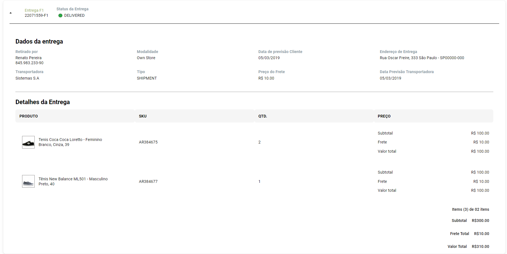
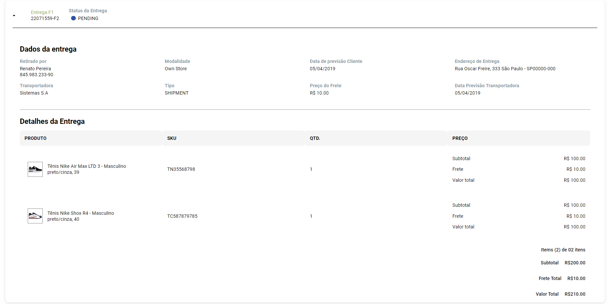

# Tratamento de Entregas (desafio Front-End)

## Descrição

Este é um projeto desenvolvido para gerenciar e exibir dados de entregas, utilizando Redux para gerenciamento de estados, Sass para estilização e um hook personalizado com UseMemo para realizar o cálculo otimizado dos preços.

## 📝 Funcionalidades

**Gerenciamento de estados**: Redux foi implementado para lidar com os dados carregados de um arquivo JSON, permitindo melhor controle sobre o estado global do aplicativo.

**Estilização avançada**: A interface foi estilizada utilizando Sass, garatindo uma estrutura modular e reutilizável para os estilos.

**Cálculo otimizado de preços**: Um hook personalizado utilizando UseMemo realiza o cálculo dos preços de forma eficiente e dinâmica, reduzindo o custo computacional.

### Tela Inicial

### Primeiro Pedido

### Segundo Pedido

## 🛠️ Tecnologias Utilizadas

- **React**
- **Redux** (para gerenciamento de estado)
- **Sass** (para estilização)
- **Vite** (para o ambiente de desenvolvimento)
- **UseMemo** (Hook para otimização do cálculo dos preços)
- **JSON** (Utilizado como fonte de dados para simular uma API)

## Instalação

## Pré-requisitos

- **Node.js** (você pode verificar se está instalado usando node -v)
- **npm ou yarn** para gerenciar dependências.

## Passo a passo

1. Clone o repositório:

2. Navegue até o diretório do projeto:

cd ecommerce-app

3. Instale as dependências:

npm install

# ou

yarn install

4. Execute o projeto:

npm run dev

# ou

yarn dev
O projeto estará disponível em http://localhost:5173.

## 💡 Destaques Técnicos

- Redux:
  Centraliza o estado global da aplicação, garantindo previsibilidade e facilidade de depuração.

- useMemo:
  Reduz o custo computacional ao recalcular valores apenas quando dependências específicas são alteradas.

- Sass:
  Facilita o uso de variáveis, mixins e aninhamento para uma estrutura de CSS organizada e eficiente.

Licença
Este projeto está licenciado sob a MIT License.
